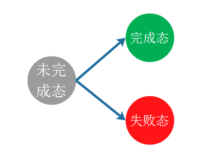

# Promise

## 概述

在Promise之前，在js中的异步编程都是采用回调函数和事件的方式，但是这种编程方式在处理复杂业务的情况下，很容易出现callback hell(回调地狱)，使得代码很难被理解和维护。

Promise 是异步编程的一种解决方案，比传统的解决方案——回调函数和事件——更合理和更强大。

## 基本用法

ES6 规定，Promise对象是一个构造函数，用来生成Promise实例。


### resolve、reject

在Promise中，对一个异步操作做出了抽象的定义，Promise操作只会处在3种状态的一种，，他们之间的转化如图所示




resolve函数的作用是，将Promise对象的状态从“未完成”变为“成功”（即从 pending 变为 resolved），在异步操作成功时调用，并将异步操作的结果，作为参数传递出去；

reject函数的作用是，将Promise对象的状态从“未完成”变为“失败”（即从 pending 变为 rejected），在异步操作失败时调用，并将异步操作报出的错误，作为参数传递出去。


### then

then方法可以接受两个回调函数作为参数。
第一个回调函数是Promise对象的状态变为resolved时调用，
第二个回调函数是Promise对象的状态变为rejected时调用。
其中，第二个函数是可选的，不一定要提供。这两个函数都接受Promise对象传出的值作为参数。


### Promise.prototype.catch()

Promise.prototype.catch方法是.then(null, rejection)的别名

```
const someAsyncThing = function() {
  return new Promise(function(resolve, reject) {
    // 下面一行会报错，因为x没有声明
    resolve(x + 2);
  });
};

someAsyncThing().then(function() {
  return someOtherAsyncThing();
}).catch(function(error) {
  console.log('oh no', error);
  // 下面一行会报错，因为 y 没有声明
  y + 2;
}).then(function() {
  console.log('carry on');
});
```

### Promise.prototype.done()

Promise对象的回调链，不管以then方法或者catch方法结尾，要是最后一个方法抛出错误，都有可能无法捕捉到，因为Promise内部的错误不会冒泡到全局，因此，我们可以提供一个done方法，总是处理回调链的尾端，保证抛出任何可能出现的错误。


### Promise.prototype.finally()

finally方法用于指定不管 Promise 对象最后状态如何，都会执行的操作。

### Promise.all()

Promise.all方法用于将多个 Promise 实例，包装成一个新的 Promise 实例。

```
const p = Promise.all([p1, p2, p3]);
```

新的Promise实例p的状态由p1, p2, p3决定：

当p1, p2, p3的状态都为**完成态**时，p为完成态。

p1, p2, p3中任一一个状态为**失败态**，则p为失败态。


### Promise.race()

Promise.race方法同样是将多个 Promise 实例，包装成一个新的 Promise 实例。

```
const p = Promise.race([p1, p2, p3]);
```

不同的是，只要p1, p2, p3中任意一个实例率先改变状态，则p的状态就跟着改变，而且状态由率先改变的实例决定。

```
var p = Promise.race([
    new Promise(resolve => {
        setTimeout(() => resolve('p1'), 10000);
    }),
    new Promise((resolve, reject) => {
        setTimeout(() => reject(new Error('time out')), 10);
    })
]);
p.then( ret => console.log(ret))
    .catch( err => console.log(err.toString()));
```


### Promise.resolve()

Promise.resolve()可以将现有的对象转为Promise对象

```
var p = Promise.resolve('p');

// 相当于
var p = new Promise(resolve => resolve('p'));
```


### Promise.reject()

Promise.reject()返回一个新的Promise实例，该实例的状态为rejected，对于传入的参数的处理跟Promise.resolve类似，就是状态都为rejected。

### Promise.try()

